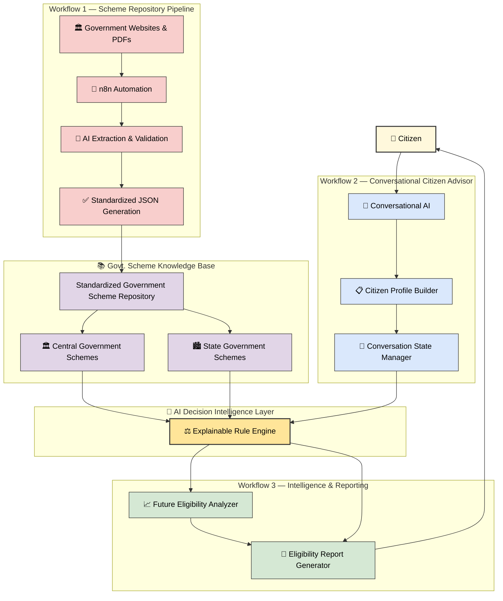

# JanMitra AI

### An AI-powered Welfare Intelligence Platform for Personalized Government Scheme Discovery and Eligibility Advisory.

> Helping every citizen discover the right government schemes through conversational AI, intelligent eligibility analysis, and future benefit prediction.

## 📖 Project Overview

JanMitra AI is an AI-powered citizen welfare advisor designed to simplify access to government welfare schemes in India.

Instead of expecting citizens to manually search through hundreds of government schemes and understand complex eligibility criteria, JanMitra AI conducts a natural conversation with the user, builds a structured citizen profile, evaluates eligibility using an explainable Rule Engine, predicts future eligibility, and provides a personalized report with actionable recommendations.

The platform is designed to bridge the information gap between citizens and government welfare programs while ensuring transparency, explainability, and ease of access.

## 🚨 Problem Statement

India offers hundreds of welfare schemes across Central and State Governments. However, discovering the right scheme remains difficult for many citizens due to fragmented information, complex eligibility conditions, and limited personalized guidance.

While existing government platforms such as myScheme have significantly improved access to scheme information, the current experience is primarily centered around scheme discovery rather than personalized welfare advisory. Citizens are still required to interpret eligibility criteria, compare multiple schemes, and determine their own eligibility.

As a result, users often do not receive answers to important questions such as:

- Which schemes am I actually eligible for?
- Why am I not eligible for a particular scheme?
- Which eligibility conditions did I fail?
- What should I do to become eligible?
- When will I become eligible in the future?
- Which documents will I need before applying?

This information gap can discourage citizens from exploring welfare programs and may prevent deserving beneficiaries from accessing government support.

## 💡 Our Solution

JanMitra AI transforms scheme discovery into an intelligent conversational experience.

The system interacts with citizens in natural language, collects only the information required to evaluate eligibility, and uses an explainable Rule Engine to match citizens with relevant government welfare schemes.

Beyond simple eligibility checking, JanMitra AI also:

- Explains why a citizen is eligible or ineligible.
- Identifies disqualifying conditions.
- Predicts future eligibility based on changing circumstances.
- Provides actionable recommendations for becoming eligible.
- Generates a comprehensive eligibility report for complete transparency.

This approach enables citizens to make informed decisions while significantly improving accessibility to government welfare programs.

## ✨ Key Features

- 🤖 **Conversational Citizen Profiling**
  - Collects citizen information through a natural language conversation instead of lengthy forms.

- 📚 **Structured Government Scheme Repository**
  - Stores government schemes in a standardized JSON format for consistent processing and evaluation.

- ⚖️ **Explainable Rule Engine**
  - Evaluates citizen eligibility against scheme rules and clearly explains every eligibility decision.

- 🔍 **Eligibility Analysis**
  - Identifies eligible schemes, partially eligible schemes, and disqualified schemes based on user information.

- 📈 **Future Eligibility Analyzer**
  - Predicts when a citizen may become eligible and identifies the conditions required to qualify in the future.

- 📄 **Eligibility Report Generator**
  - Generates a comprehensive report containing eligibility status, failed conditions, recommendations, and required documents.

- 🔄 **Automated Scheme Repository Pipeline**
  - Uses n8n workflows and AI-assisted data extraction to convert government websites and PDFs into standardized JSON datasets.

- 💬 **AI-powered Welfare Advisory**
  - Provides personalized recommendations, eligibility explanations, and next steps for citizens.

  ## 🏗️ System Architecture



---

# 📂 Project Structure

```text
janmitra-ai/
│
├── backend/                      # Backend APIs (planned)
├── frontend/                     # Web application (planned)
├── docs/                         # Project documentation
├── n8n/                          # n8n automation workflows
├── notebooks/                    # Research & prototype notebooks
│   └── RuleEngine.ipynb
│
├── prompts/                      # AI prompts
│   └── scheme_to_json.md
│
├── repository/
│   ├── extracted/                # Raw AI extracted scheme data
│   ├── metadata/                 # Scheme inventories & metadata
│   ├── normalized/               # Cleaned datasets
│   ├── raw/                      # Original source files
│   ├── schemes/
│   │   └── social_security/
│   │       └── delhi_old_age_pension.json
│   │
│   ├── schema.json
│   ├── citizen_attributes.json
│   ├── citizen_profile_schema.json
│   └── conversation_state_schema.json
│
├── .gitignore
├── README.md
└── requirements.txt
```

---

# 💻 Technology Stack

| Category | Technology | Status |
|----------|------------|--------|
| Programming Language | Python | ✅ In Use |
| Workflow Automation | n8n | ✅ In Use |
| Version Control | Git | ✅ In Use |
| Repository Hosting | GitHub | ✅ In Use |
| Data Storage | JSON | ✅ In Use |
| Development Environment | Jupyter Notebook | ✅ In Use |
| AI-Assisted Development | OpenAI (ChatGPT) | ✅ In Use |
| Backend API | FastAPI | 🚧 Planned |
| Frontend | React.js | 🚧 Planned |
| Database | PostgreSQL | 🚧 Planned |
| Containerization | Docker | 🚧 Planned |

---

# ⚙️ Installation Guide

## Prerequisites

Before setting up JanMitra AI, ensure the following software is installed:

- Python 3.11 or later
- Git
- Jupyter Notebook or JupyterLab
- Visual Studio Code (recommended)
- n8n (for workflow automation)

---

## Clone the Repository

```bash
git clone https://github.com/eshitanarang/janmitra-ai.git
```

Move into the project directory:

```bash
cd janmitra-ai
```

---

## Create a Virtual Environment

### Windows

```bash
python -m venv .venv
.venv\Scripts\activate
```

### macOS / Linux

```bash
python3 -m venv .venv
source .venv/bin/activate
```

---

## Install Dependencies

```bash
pip install -r requirements.txt
```

---

## Current Prototype Components

The current prototype includes:

- Standardized Government Scheme JSON Schema
- Citizen Attributes Schema
- Citizen Profile Schema
- Conversation State Schema
- Sample normalized government scheme (Delhi Old Age Pension Scheme)
- Rule Engine
- Future Eligibility Analyzer
- Eligibility Report Generator

Launch Jupyter Notebook:

```bash
jupyter notebook
```

Open:

```text
notebooks/RuleEngine.ipynb
```

Run all cells to execute the eligibility evaluation pipeline.

---

## Planned Components

The following modules will be added in upcoming development phases:

- FastAPI Backend
- React Frontend
- Conversational Citizen Advisor
- n8n Workflow Automation
- Dashboard & Report Module
- PostgreSQL Database

---

# 🌿 Development Workflow

JanMitra AI follows a Git-based collaborative development workflow to ensure code quality, maintainability, and smooth team collaboration.

## Branching Strategy

```text
main
│
├── Production-ready and stable code
│
└── dev
     │
     ├── feature/<feature-name>
     ├── feature/<feature-name>
     ├── feature/<feature-name>
     └── ...
```

### Branch Descriptions

| Branch | Purpose |
|----------|---------|
| `main` | Stable, production-ready code |
| `dev` | Active development branch |
| `feature/*` | Individual feature development branches |

---

## Development Process

Every new feature follows the workflow below:

```text
Clone Repository
        │
        ▼
Checkout dev Branch
        │
        ▼
Create Feature Branch
        │
        ▼
Develop & Test
        │
        ▼
Commit Changes
        │
        ▼
Push Feature Branch
        │
        ▼
Create Pull Request → dev
        │
        ▼
Code Review
        │
        ▼
Merge into dev
        │
        ▼
Release to main
```

---

## Contribution Guidelines

1. Pull the latest changes from the `dev` branch before starting work.
2. Create a new feature branch for every independent task.
3. Commit changes with meaningful commit messages.
4. Push your feature branch to GitHub.
5. Open a Pull Request targeting the `dev` branch.
6. Merge into `main` only after testing and review.

---

## Example Git Workflow

```bash
# Clone the repository
git clone https://github.com/eshitanarang/janmitra-ai.git

# Switch to development branch
git checkout dev

# Create a new feature branch
git checkout -b feature/workflow-1

# Stage changes
git add .

# Commit changes
git commit -m "Add Workflow 1 repository automation"

# Push feature branch
git push origin feature/workflow-1
```
---


# 📌 Current Project Status

JanMitra AI is currently under active development. The project follows a modular architecture, with each component being developed and tested independently before integration.

## Development Progress

| Module | Status |
|----------|--------|
| Standardized Government Scheme JSON Schema | ✅ Completed |
| Citizen Attributes Schema | ✅ Completed |
| Citizen Profile Schema | ✅ Completed |
| Conversation State Schema | ✅ Completed |
| Delhi Old Age Pension Scheme (Sample) | ✅ Completed |
| Rule Engine | ✅ Completed |
| Future Eligibility Analyzer | ✅ Completed |
| Eligibility Report Generator | ✅ Completed |
| GitHub Repository Setup | ✅ Completed |
| Project Documentation | 🚧 In Progress |
| Workflow 1 – Scheme Repository Pipeline | 🚧 In Progress |
| Workflow 2 – Conversational Citizen Advisor | ⏳ Planned |
| Workflow 3 – Dashboard & Reporting Integration | ⏳ Planned |
| Backend API | ⏳ Planned |
| Frontend Application | ⏳ Planned |
| Database Integration | ⏳ Planned |
| Multi-Scheme Repository | ⏳ Planned |

---

## Current Milestone

**Phase 1 – Foundation & Core Intelligence**

Current focus areas include:

- Building the standardized government scheme repository
- Automating scheme ingestion using n8n
- Expanding the repository with additional Central and State Government schemes
- Strengthening the Rule Engine and eligibility evaluation logic
- Preparing reusable modules for backend integration

---

## Next Milestone

**Phase 2 – Conversational AI Platform**

Upcoming development includes:

- Conversational citizen advisor
- Dynamic profile building
- Intelligent question generation
- Backend API development
- Frontend web application
- Interactive eligibility dashboard
- Personalized citizen reports


---

# 🗺️ Project Roadmap

JanMitra AI is being developed incrementally, with each phase building upon the previous one to create a scalable AI-powered citizen welfare platform.

| Phase | Milestone | Status |
|--------|-----------|--------|
| Phase 1 | Project foundation, JSON schemas, Rule Engine, Future Eligibility Analyzer, Eligibility Report Generator | ✅ Completed |
| Phase 2 | Government Scheme Repository Pipeline (Workflow 1) | 🚧 In Progress |
| Phase 3 | Conversational Citizen Advisor (Workflow 2) | ⏳ Planned |
| Phase 4 | Dashboard & Reporting Module (Workflow 3) | ⏳ Planned |
| Phase 5 | FastAPI Backend & REST APIs | ⏳ Planned |
| Phase 6 | React Frontend & User Interface | ⏳ Planned |
| Phase 7 | Multi-state Scheme Repository & Scalability | ⏳ Planned |
| Phase 8 | Production Deployment & Public Release | ⏳ Planned |

---

## Long-Term Vision

Our goal is to build an AI-powered digital welfare advisor that can:

- Discover government schemes personalized to each citizen
- Explain eligibility and ineligibility in simple language
- Predict future eligibility based on changing life circumstances
- Continuously maintain an up-to-date government scheme knowledge base
- Support multilingual conversational interactions
- Scale across Central, State, and Local Government welfare schemes

---

# 👥 Team

JanMitra AI is being developed as a collaborative hackathon project with the vision of making government welfare schemes more accessible through Artificial Intelligence.

| Role | Responsibilities |
|------|------------------|
| **Project Lead & AI Engineer** | Project planning, system architecture, repository design, JSON schemas, Rule Engine, Future Eligibility Analyzer, Eligibility Report Generator, GitHub management and technical integration |
| **AI Workflow Engineer** | Development of Workflow 1, n8n automation, government scheme extraction pipeline, data validation and standardized JSON generation |
| **UI/Documentation & Research** | Presentation design, documentation, user experience, research, testing, project demonstrations and communication |

---

## Collaboration Principles

Our team follows a collaborative development approach:

- Feature-based development using Git branches
- Code reviews through Pull Requests
- Modular architecture for independent development
- Clear documentation for every major component
- Incremental development with continuous integration


---

# 🤝 Contributing

We welcome contributions that help improve JanMitra AI. Whether you're fixing bugs, improving documentation, developing new features, or enhancing AI workflows, your contributions are appreciated.

## How to Contribute

1. Team members can clone the repository 
2. Create a new feature branch from the `dev` branch.
3. Implement and test your changes.
4. Commit your changes with clear and descriptive commit messages.
5. Push your branch to GitHub.
6. Open a Pull Request targeting the `dev` branch.
7. Wait for code review and approval before merging.

---

## Branch Naming Convention

```text
feature/<feature-name>
bugfix/<issue-name>
hotfix/<issue-name>
docs/<documentation-name>
```

Examples:

```text
feature/workflow-1
feature/chat-interface
bugfix/rule-engine
docs/readme-update
```

---

## Commit Message Guidelines

Use meaningful commit messages that clearly describe your changes.

Examples:

```text
feat: implement Workflow 1 repository pipeline

fix: correct rule evaluation logic

docs: update project roadmap

refactor: simplify rule engine implementation
```

---

## Code Standards

Please ensure that your contributions:

- Follow the existing project structure.
- Keep modules independent and reusable.
- Update documentation whenever new functionality is added.
- Test changes before creating a Pull Request.
- Do not commit sensitive information such as API keys or credentials.

---

## Questions or Suggestions

If you have questions, ideas, or suggestions, feel free to open an Issue or start a discussion through GitHub.

---

# 📄 License

Copyright © 2026 JanMitra AI Team. All rights reserved.

This repository is currently made publicly available for hackathon evaluation, project demonstration, and collaborative development.

Unless explicitly stated otherwise, no part of this project's source code may be copied, modified, redistributed, or used in other projects without prior written permission from the project owners.

---

# 🙏 Acknowledgements

We would like to express our gratitude to everyone and every initiative that has contributed to the development of JanMitra AI.

Special thanks to:

- Government of India for promoting digital public services and citizen welfare initiatives.
- Official Government websites and public welfare scheme portals for providing publicly accessible scheme information.
- The hackathon organizers for providing a platform to innovate and solve real-world problems.
- The open-source community for building tools and technologies that power this project.

---

## Built With

- Python
- Jupyter Notebook
- n8n
- Git & GitHub
- JSON
- Artificial Intelligence

---

## 🌟 Our Vision

JanMitra AI aims to bridge the gap between citizens and government welfare schemes through explainable Artificial Intelligence.

Our vision is to build an intelligent digital welfare advisor that helps every citizen discover the right government schemes, understand their eligibility, and access public benefits with confidence.

Together, we envision a future where government welfare is more accessible, transparent, and inclusive for everyone.